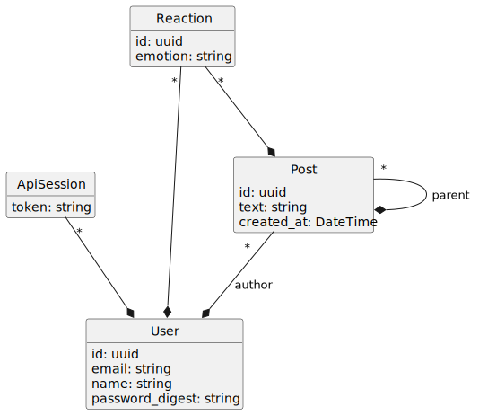
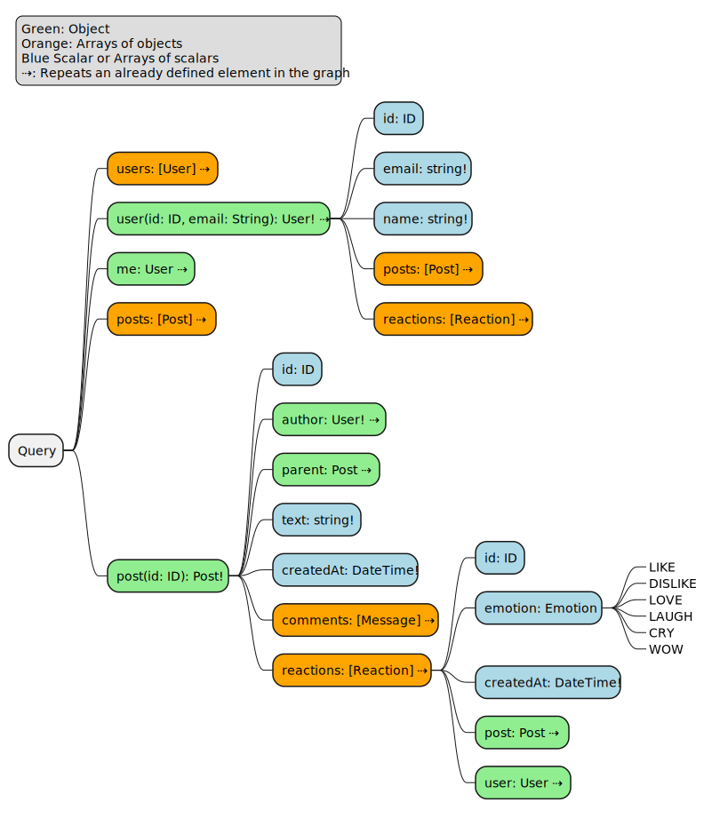

# graphql_examples

Compare different implementations of GraphQL on the server side. A bit like TodoMVC, but
with a different example, showing features of GraphQL and how to implement them in various
languages and frameworks.

- [graphql\_examples](#graphql_examples)
  - [Where to find implementations?](#where-to-find-implementations)
  - [Application to build](#application-to-build)
    - [Data Model](#data-model)
    - [GraphQL Schema](#graphql-schema)
      - [Query Object](#query-object)
      - [Mutations](#mutations)
    - [Goals](#goals)
      - [Avoid N+1 Queries to the Database](#avoid-n1-queries-to-the-database)
  - [Tests](#tests)
  - [Development](#development)
    - [Generate PlantUML Diagrams as Images](#generate-plantuml-diagrams-as-images)
  - [Service Depdencies and Development Container](#service-depdencies-and-development-container)
  - [Ideas for the future](#ideas-for-the-future)

## Where to find implementations?

In the `examples` folder of this repository, named by convention `language_framework_library`
(examples: `ruby_on_rails_ruby_graphql`, `rust_juniper`).

## Application to build

A minimalist post system, à la Facebook, with users, posts, comments and a possibility
to _like_ the posts.

### Data Model



A post

- belongs to a user
- has many likes
- may belong to a parent post, if its a comment

A like

- belongs to a post
- belongs to a user

A user

- has many posts
- has many likes

### GraphQL Schema

#### Query Object



#### Mutations

See [mutations](mutation.md).

### Goals

#### Avoid N+1 Queries to the Database

Use batch loading when available to the language and framework of choice.

## Tests

An implementation agnostic test suite, in _JavaScript_, is in `tests`.

To execute, set the `EXAMPLE` environment variable to the directory name
you want to test (subdirectory of `examples`) and call `yarn mocha` from
the `tests` directory.

```bash
EXAMPLE=ruby_on_rails_ruby_graphql yarn test
EXAMPLE=ruby_on_rails_ruby_graphql yarn test tests/scenarios/users.test.ts
```

For watch file and only execute a single file on save:

```bash
EXAMPLE=ruby_on_rails_ruby_graphql yarn watch
EXAMPLE=ruby_on_rails_ruby_graphql yarn watch tests/scenarios/users.test.ts
```

## Development

### Generate PlantUML Diagrams as Images

At this moment, generating them using the [_PlantUML_ plugin of _VSCode_](https://marketplace.visualstudio.com/items?itemName=jebbs.plantuml),
calling the _PlantUML: Export Workspace Diagrams_ command, and choosing _svg_.

## Service Depdencies and Development Container

This workspace is set up for _Visual Studio Code_ and includes a [devcontainer](https://code.visualstudio.com/docs/devcontainers/containers).

Upon opening it up in _Visual Studio Code_, click _Open in container_ in the bottom-right popup that appears. The required services (eg: _PostgreSQL_) and the development environment itself will build (only once) and then you're all set to work on this project, without installing anything else than _Docker_ and _Visual Studio Code_ on your computer.

## Ideas for the future

- Connections/Nodes/Edges
  - Arrays can be paginated
- Relay-Style Object Identification
  - Objects export their GID
  - Objects are obtainable from their GID
