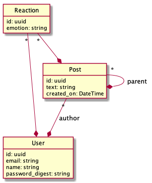
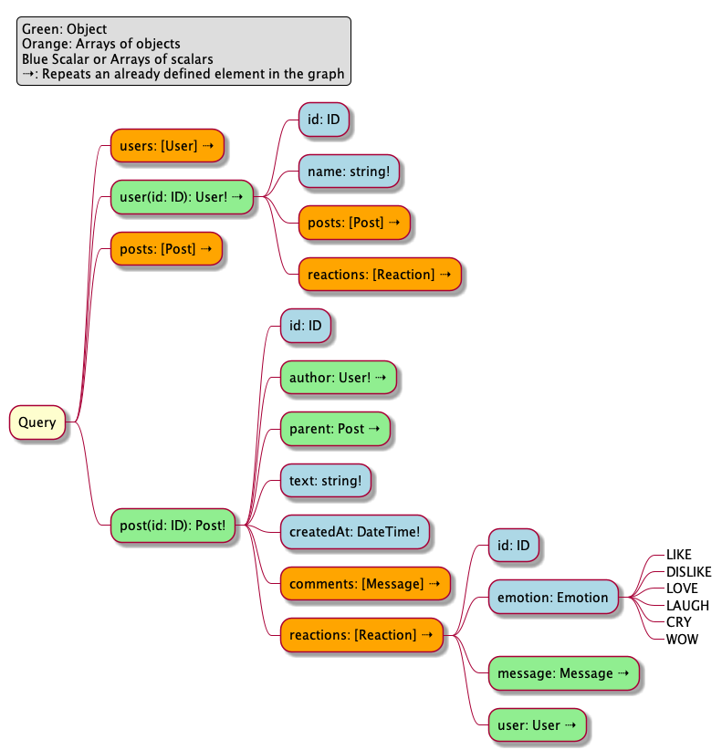
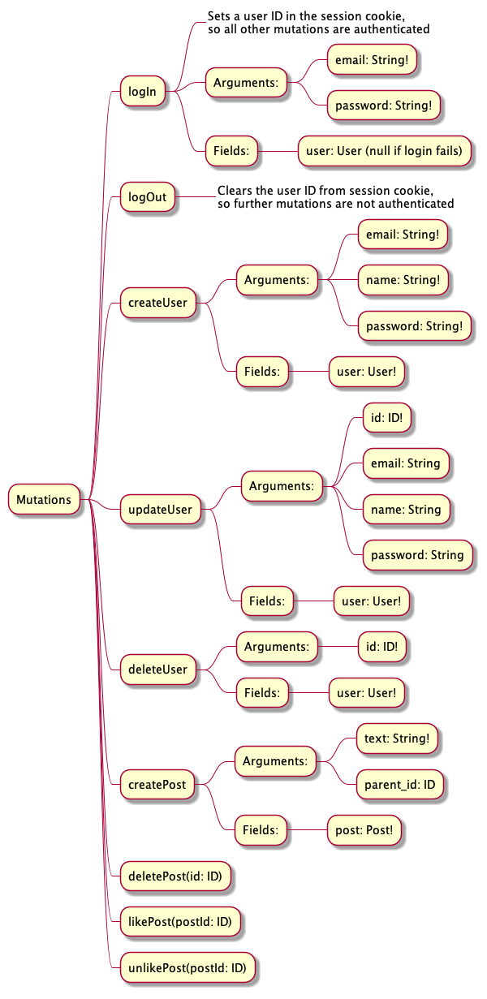

# graphql_examples

Compare different implementations of GraphQL on the server side. A bit like TodoMVC, but
with a different example, showing features of GraphQL and how to implement them in various
languages and frameworks.

# Where to find implementations?

In the `examples` folder of this repository, named by convention `language_framework_library`
(examples: `ruby_on_rails_ruby_graphql`, `rust_juniper`).

# Application to build

A minimalist post system, à la Facebook, with users, posts, comments and a possibility
to *like* the posts.

## Data Model

A post
- belongs to a user
- has many likes
- may belong to a parent post, if its a comment

A like
- belongs to a post
- belongs to a user

A user
- has many posts
- has many likes

## GraphQL Schema

### Query Object

### Mutations

## Goals

### Avoid N+1 Queries to the Database

Use batch loading when available to the language and framework of choice.
